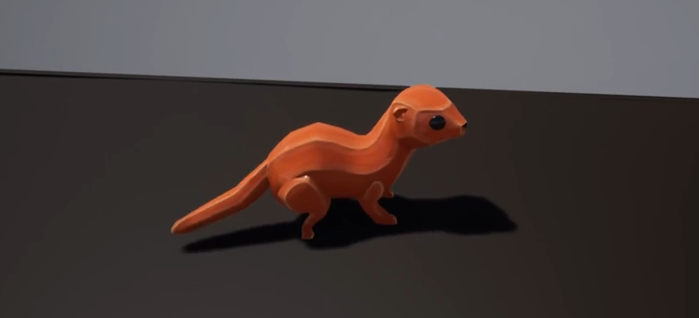

# Famils: AI Avatar Creature Companions in Augmented Reality

## Overview
Famils are unique, animated creatures serving as avatars for artificial intelligence, designed for interaction in augmented reality environments. This project emphasizes open-source principles, allowing users to fully own and customize their AI companions.

## Inspirations

- **Ghosts (Destiny)**: Intelligent companions providing guidance and support.
- **Daemons (His Dark Materials)**: Embodiments of one’s soul, fostering deep personal connections.

## Components
1. **Open-Source Interface**: Integration with Mycroft, an open-source voice assistant. Uses the open source [Avatar-Link](https://github.com/Dayruke/Avatar-Link).
2. **Character Avatar for AI**: Interactive, animated familiars driven by user input.
3. **AR Interactions**: Enable engagement with characters in augmented reality.

## Technical Details
- **Engine**: Built in Unreal Engine (4.22).
- **Scripting**: Blueprint-scripted. Quality not guaranteed, but may contain useful assets.
- **Current State**: Initial prototypes developed; ongoing R&D for animation and behavior.

## Getting Involved
This project is no longer active. Explore the repository for assets and documentation. 

## License
This project is released under the MIT License

## Acknowledgments
Inspired by the potential of AI to foster intimacy and connection in our digital lives. 